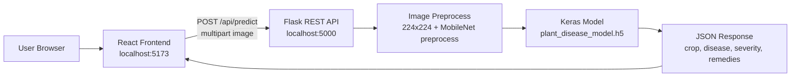

# Crop Disease Detection System — Presentation Guide

**Project:** AI-Based Crop Disease Detection (Full-Stack)  
**Author:** Srushti (update with your name/roll number)  
**Purpose:** Use this document for college/project presentation, viva, and demo.

---

## 1. Project title and one-line summary

**Title:** AI-Based Crop Disease Detection System Using Deep Learning

**One-line summary:** A web application where farmers or students upload a crop/leaf image; a **Convolutional Neural Network (CNN)** trained on the **PlantVillage** dataset predicts **crop type**, **disease name**, **health status**, **severity estimate**, **confidence**, and **treatment suggestions**.

---

## 2. Problem statement (why this project?)

- Plant diseases reduce crop yield and cause economic loss.
- Farmers may not identify diseases early without expert help.
- Manual diagnosis is slow and needs agricultural experts.
- **Solution:** Use computer vision and deep learning to classify leaf images automatically and show actionable advice on a simple website.

**Real-world use case:** Upload a photo of a tomato/potato/pepper leaf → get disease name + precautions + treatments in seconds.

---

## 3. Objectives

| # | Objective | How we achieved it |
|---|-----------|-------------------|
| 1 | Detect crop from leaf image | Class label contains crop name (e.g. `Tomato_Late_blight` → Tomato) |
| 2 | Detect disease | Same label contains disease (e.g. Late blight) |
| 3 | Healthy vs unhealthy | Label contains `healthy` or disease name |
| 4 | Show confidence | Softmax probability × 100% |
| 5 | Severity (mild/moderate/severe) | Rule-based mapping from confidence (see Section 8) |
| 6 | Precautions & treatments | `remedies.py` mapping + generic fallback |
| 7 | Easy-to-use UI | React: drag-drop, preview, results card |

---

## 4. Technology stack

| Layer | Technology | Role |
|-------|------------|------|
| **Frontend** | React (Vite), Tailwind CSS | User interface, image upload, results display |
| **API client** | Axios | HTTP calls to Flask backend |
| **Backend** | Python Flask + Flask-CORS | REST API, file upload, prediction |
| **AI/ML** | TensorFlow / Keras | Train and run CNN model |
| **Pretrained model** | **MobileNetV2** (ImageNet weights) | Transfer learning backbone (default) |
| **Image processing** | Pillow, NumPy | Resize 224×224, preprocessing |
| **Dataset** | PlantVillage | Folder-per-class image dataset |
| **Model file** | `.h5` (Keras) | Saved trained model in `backend/model/` |
| **Database** | Optional MongoDB | Not implemented yet (future scope) |

**Versions used in this project (typical):**
- Python **3.12** (virtual environment in `backend/.venv`)
- TensorFlow **2.21**
- Flask **3.1**
- React **19** + Vite **8**

---

## 5. System architecture



**Request flow (explain in presentation):**

1. User selects or drags a leaf image.
2. Frontend sends image to `POST /api/predict` (field name: `image`).
3. Backend loads `.h5` model + `class_names.json` + `training_meta.json`.
4. Image is resized to **224×224**, preprocessed for **MobileNetV2**.
5. Model outputs class probabilities (softmax).
6. Backend picks top class, derives crop/disease/healthy/severity/remedies.
7. Frontend shows prediction card, confidence bar, severity, and remedy lists.

---

## 6. Project folder structure

```text
crop-disease-detection/
├── backend/
│   ├── app.py                 # Flask app, CORS, error handling
│   ├── config.py              # Paths, image size, upload limits
│   ├── requirements.txt       # Python dependencies
│   ├── model/
│   │   ├── plant_disease_model.h5   # Trained model
│   │   ├── class_names.json         # Label order for predictions
│   │   └── training_meta.json       # Backbone + image size
│   ├── training/
│   │   └── train_model.py     # Training script (transfer learning)
│   ├── routes/
│   │   ├── health.py          # GET /api/health
│   │   ├── upload.py          # POST /api/upload
│   │   └── predict.py         # POST /api/predict
│   ├── utils/                 # Preprocess, model load, severity, remedies
│   └── uploads/               # Stored uploaded images
├── frontend/
│   └── src/                   # React components + Axios API
├── dataset/
│   └── PlantVillage/          # Training images (one folder per class)
└── docs/
    └── PROJECT_PRESENTATION_GUIDE.md   # This file
```

---

## 7. Dataset — PlantVillage

**What is PlantVillage?**
- Public dataset of **RGB leaf images** with expert labels.
- Each **class** is a folder: `CropName___DiseaseName` or `CropName___healthy`.
- Used worldwide for plant disease classification research.

**In this project:**
- Data path: `dataset/PlantVillage/`
- **Number of classes trained:** **15** (subset focused on Pepper, Potato, Tomato)
- **Full PlantVillage** can have 38+ classes (Apple, Grape, Corn, etc.) if you add all folders before training.

### Classes in your current trained model

| # | Class folder name | Crop | Condition |
|---|-------------------|------|-----------|
| 1 | Pepper__bell___Bacterial_spot | Pepper bell | Bacterial spot |
| 2 | Pepper__bell___healthy | Pepper bell | Healthy |
| 3 | Potato___Early_blight | Potato | Early blight |
| 4 | Potato___Late_blight | Potato | Late blight |
| 5 | Potato___healthy | Potato | Healthy |
| 6 | Tomato_Bacterial_spot | Tomato | Bacterial spot |
| 7 | Tomato_Early_blight | Tomato | Early blight |
| 8 | Tomato_Late_blight | Tomato | Late blight |
| 9 | Tomato_Leaf_Mold | Tomato | Leaf mold |
| 10 | Tomato_Septoria_leaf_spot | Tomato | Septoria leaf spot |
| 11 | Tomato_Spider_mites_Two_spotted_spider_mite | Tomato | Spider mites |
| 12 | Tomato__Target_Spot | Tomato | Target spot |
| 13 | Tomato__Tomato_YellowLeaf__Curl_Virus | Tomato | Yellow leaf curl virus |
| 14 | Tomato__Tomato_mosaic_virus | Tomato | Mosaic virus |
| 15 | Tomato_healthy | Tomato | Healthy |

**Presentation tip:** Say clearly: *“Our demo model is trained only on these 15 classes. Images from other crops (e.g. mango) are outside the training set and may give wrong labels.”*

---

## 8. Machine learning approach

### 8.1 Why transfer learning?

- Training a large CNN from scratch needs **millions** of images and long GPU time.
- **Transfer learning:** Use a network already trained on **ImageNet** (1.2M general images), freeze it, and train only a small **classification head** on PlantVillage.
- **Benefits:** Faster training, better accuracy with fewer plant images, works well on CPU/laptop.

### 8.2 Which model? — MobileNetV2 (default)

| Property | Value |
|----------|--------|
| **Model name** | MobileNetV2 |
| **Pretrained weights** | ImageNet (`weights="imagenet"`) |
| **Role in pipeline** | Feature extractor (backbone), **frozen** during training |
| **Input size** | **224 × 224** RGB |
| **Top of network** | Global average pooling → Dropout(0.2) → Dense(15, softmax) |
| **Why MobileNetV2?** | Lightweight, fast inference, good for real-time/web apps |

**Alternatives supported in code (optional):**
- `mobilenet_v3_small`, `mobilenet_v3_large`
- `efficientnet_b0` (heavier, often slightly more accurate)

### 8.3 Training hyperparameters (defaults)

| Parameter | Default value | Meaning |
|-----------|---------------|---------|
| **Epochs (max)** | **15** | Maximum training passes; may stop earlier |
| **Batch size** | **32** | Images per gradient update |
| **Learning rate** | **0.001** | Adam optimizer step size |
| **Validation split** | **20%** | 80% train / 20% validation |
| **Random seed** | **42** | Reproducible train/val split |
| **Loss** | Sparse categorical crossentropy | Multi-class classification |
| **Optimizer** | Adam | Standard for deep learning |
| **Data augmentation** | Random flip + rotation (~8°) | Reduces overfitting |

### 8.4 Training callbacks (automatic)

| Callback | Purpose |
|----------|---------|
| **EarlyStopping** | Stops if validation accuracy does not improve for **4 epochs**; restores best weights |
| **ReduceLROnPlateau** | Halves learning rate if validation loss plateaus (patience **2**) |

So actual epochs trained may be **less than 15** if the model converges early.

### 8.5 Your training results (from `training_meta.json`)

| Metric | Value |
|--------|--------|
| **Backbone** | mobilenet_v2 |
| **Image size** | 224 × 224 |
| **Number of classes** | 15 |
| **Best validation accuracy** | **~92.59%** (0.9259) |
| **Trained on** | `dataset/PlantVillage` |
| **Saved model** | `backend/model/plant_disease_model.h5` |

**How to say it in presentation:**  
*“We achieved approximately **92.6% validation accuracy** on a 15-class subset of PlantVillage using transfer learning with a frozen MobileNetV2 backbone.”*

---

## 9. Training command (example for slides)

```powershell
cd crop-disease-detection\backend
.\.venv\Scripts\Activate.ps1
python training\train_model.py --data-dir "..\dataset\PlantVillage"
```

**With custom options (example):**

```powershell
python training\train_model.py ^
  --data-dir "..\dataset\PlantVillage" ^
  --backbone mobilenet_v2 ^
  --epochs 15 ^
  --batch-size 32 ^
  --learning-rate 0.001 ^
  --output plant_disease_model.h5
```

**Outputs after training:**

| File | Purpose |
|------|---------|
| `plant_disease_model.h5` | Full Keras model for inference |
| `class_names.json` | Index → label string (must match training order) |
| `training_meta.json` | Backbone name + image size for correct preprocessing |

---

## 10. Inference (prediction) pipeline

1. **Load model** from `backend/model/*.h5` (cached in memory after first request).
2. **Read image** (upload or saved file).
3. **Convert to RGB**, resize to **224×224**.
4. **Preprocess** using `mobilenet_v2.preprocess_input` (must match training — read from `training_meta.json`).
5. **Forward pass** → softmax vector of length 15.
6. **Argmax** → predicted class index → label from `class_names.json`.
7. **Post-processing:**
   - Split label into **crop** and **disease** (`Crop___Disease` format).
   - **Healthy?** if label contains `healthy`.
   - **Severity:** heuristic from confidence (see below).
   - **Remedies:** text from `remedies.py`.

### Severity rules (current implementation)

| Condition | Severity |
|-----------|----------|
| Predicted **healthy** | `none` |
| Diseased + confidence ≥ 85% | `severe` |
| Diseased + confidence ≥ 65% | `moderate` |
| Diseased + confidence < 65% | `mild` |

**Important for viva:** Severity is a **simple rule**, not a separate disease-severity model. Confidence means “sure about the class,” not “how bad the disease is on the leaf.”

---

## 11. Backend API endpoints

| Method | Endpoint | Description |
|--------|----------|-------------|
| GET | `/api/health` | Server OK + `model_ready` (`.h5` exists?) |
| POST | `/api/upload` | Save image to `uploads/` (field: `image`) |
| POST | `/api/predict` | Run CNN on image (field: `image` or JSON `filename`) |

**Example successful prediction JSON (fields shown in UI):**

```json
{
  "success": true,
  "crop": "Tomato",
  "disease": "Late_blight",
  "predicted_label": "Tomato_Late_blight",
  "healthy": false,
  "health_status": "unhealthy",
  "severity": "moderate",
  "confidence": 0.91,
  "confidence_percent": 91.0,
  "top_predictions": [...],
  "precautions": ["...", "..."],
  "treatments": ["...", "..."]
}
```

---

## 12. Frontend features (demo)

| Feature | Description |
|---------|-------------|
| Drag & drop upload | User-friendly image selection |
| Image preview | See selected leaf before analyze |
| Analyze button | Calls `/api/predict` via Axios |
| Backend status badge | Shows if API and model are ready |
| Prediction card | Crop, disease, healthy/unhealthy |
| Confidence progress bar | Visual % confidence |
| Severity indicator | Mild / moderate / severe |
| Remedy section | Precautions + treatments |
| Top-3 alternatives | Shows model uncertainty |
| Loading spinner | While TensorFlow predicts |
| Responsive layout | Tailwind CSS, mobile-friendly |

**Run frontend:**

```powershell
cd frontend
npm run dev
```

Open: `http://localhost:5173`

---

## 13. How to run live demo (presentation day)

**Terminal 1 — Backend:**

```powershell
cd backend
.\.venv\Scripts\Activate.ps1
python app.py
```

**Terminal 2 — Frontend:**

```powershell
cd frontend
npm run dev
```

**Demo images to use (reliable):**
- Tomato leaf with late blight (from your dataset folder)
- Potato healthy / late blight
- Pepper bell healthy or bacterial spot

**Avoid for demo:** Mango, apple, or random leaves **not** in the 15 classes — model will guess wrong.

---

## 14. Limitations (honest points for viva — examiners like this)

1. **Fixed class set:** Model only knows **15 classes**; cannot detect mango, rice, etc. unless retrained with new data.
2. **Forced prediction:** Network always outputs one of 15 labels — no built-in “unknown crop” (can be added as future work).
3. **Severity is heuristic:** Based on confidence, not leaf area damage measurement.
4. **Remedies are template text:** Not from a medical/expert system database; should be verified with agricultural extension services.
5. **Single leaf image:** Does not use multi-image or field-level context (weather, soil, etc.).
6. **CPU training/inference:** Slower than GPU; first prediction may take time while TensorFlow loads.
7. **Subset dataset:** Full PlantVillage has more crops; expanding folders improves generalization.

**Example you observed:** A **mango leaf with galls** was labeled **Pepper healthy** because mango is **not** in training — the model picked the least-wrong class among 15 options (~76% confidence).

---

## 15. Future enhancements (scope for presentation “future work” slide)

- Train on **full PlantVillage** (38+ classes).
- Add **confidence threshold** → show “Unknown / not in training set” if max probability < 70%.
- **Fine-tune** last layers of MobileNet (unfreeze backbone partially).
- **MongoDB** to save user history, images, and predictions.
- **Grad-CAM** heatmaps to show which leaf regions influenced the decision.
- **Mobile app** or PWA for farmers.
- Custom dataset for **local crops** (e.g. mango gall midge) with new folders and retrain.
- Separate **severity model** using segmented diseased area (%).

---

## 16. Suggested presentation slide outline (10–12 slides)

| Slide | Title | Content |
|-------|--------|---------|
| 1 | Title | Project name, your name, department, date |
| 2 | Introduction | Problem: crop diseases, need for AI help |
| 3 | Objectives | 7 goals (crop, disease, health, severity, confidence, remedies) |
| 4 | Literature / existing work | PlantVillage dataset, CNNs in agriculture |
| 5 | System architecture | Diagram (Section 5) |
| 6 | Tech stack | React, Flask, TensorFlow, MobileNetV2 |
| 7 | Dataset | PlantVillage, 15 classes table (Section 7) |
| 8 | ML methodology | Transfer learning, frozen MobileNetV2, 224×224 |
| 9 | Training details | Epochs 15, batch 32, LR 0.001, val acc **92.6%** |
| 10 | Demo / screenshots | Upload UI + prediction card |
| 11 | Results & discussion | Accuracy, sample predictions, limitations |
| 12 | Conclusion & future work | Summary + MongoDB, more classes, unknown detection |

---

## 17. Sample viva questions and answers

**Q: Why MobileNetV2 and not a custom CNN?**  
A: MobileNetV2 is pretrained on ImageNet, lightweight, and fast for web deployment. Transfer learning gives high accuracy with less data and training time.

**Q: What is transfer learning?**  
A: Reusing weights learned on a large dataset (ImageNet), freezing the feature extractor, and training only new layers for our plant disease classes.

**Q: How many epochs did you use?**  
A: Maximum **15**, with **EarlyStopping** — training can stop earlier when validation accuracy stops improving.

**Q: What is validation accuracy?**  
A: Percentage of correct predictions on the **20% hold-out** validation split not used for weight updates. Ours is about **92.6%** on 15 classes.

**Q: Why wrong result on mango leaf?**  
A: Mango was not in the 15 training classes. The model must choose one known label; it guessed the closest wrong class.

**Q: What is softmax?**  
A: Output layer that converts scores to probabilities summing to 1; highest probability is the predicted class.

**Q: Difference between training and prediction preprocessing?**  
A: They must be identical. We save backbone info in `training_meta.json` so the API uses the same `preprocess_input` as training.

---

## 18. Key numbers to remember (quick cheat sheet)

| Item | Value |
|------|--------|
| Input image size | **224 × 224** |
| Default backbone | **MobileNetV2 (ImageNet)** |
| Max epochs | **15** |
| Batch size | **32** |
| Learning rate | **0.001** |
| Train/val split | **80% / 20%** |
| Classes (current model) | **15** |
| Validation accuracy | **~92.6%** |
| Backend port | **5000** |
| Frontend port | **5173** |
| Model file | **plant_disease_model.h5** |

---

## 19. References (cite in presentation)

1. PlantVillage Dataset — Mohanty et al., plant disease classification.  
2. TensorFlow Keras Applications — MobileNetV2 documentation.  
3. Transfer Learning in CNNs — general deep learning textbooks / courses.  
4. Flask & React official documentation for full-stack architecture.

*(Add your college format: IEEE / APA as required.)*

---

## 20. Conclusion (closing statement for presentation)

We built a **full-stack crop disease detection system** that combines a **React** frontend, **Flask REST API**, and a **Keras CNN** based on **transfer learning with MobileNetV2**. The model was trained on the **PlantVillage** dataset (**15 classes**, pepper/potato/tomato) with about **92.6% validation accuracy**. The system returns crop and disease labels, health status, confidence, severity estimate, and remedy suggestions. Limitations include fixed class labels and the need for retraining for new crops. Future work includes expanding classes, unknown-crop detection, and database integration.

---

*Document location: `docs/PROJECT_PRESENTATION_GUIDE.md` — update class count and accuracy if you retrain on more data.*
